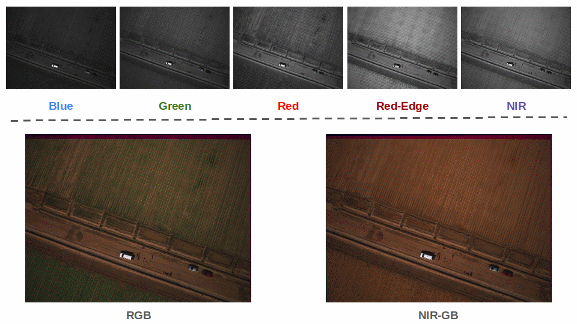
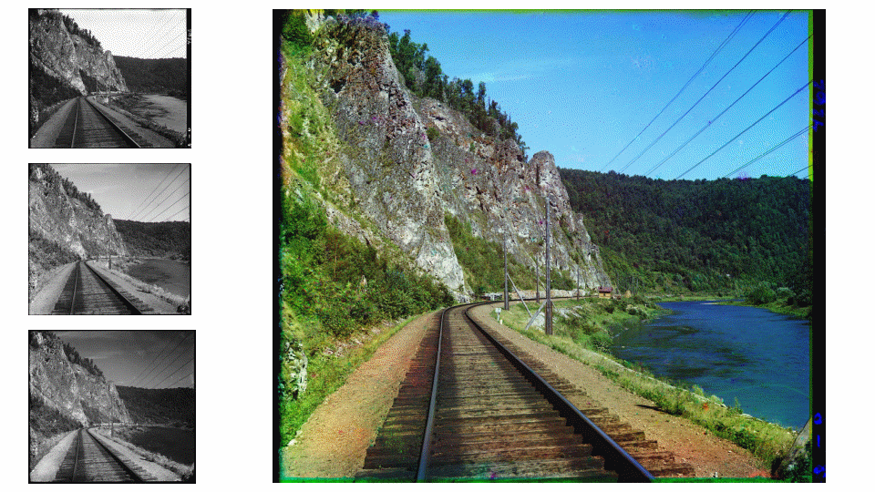

# 📝 image_registration

Toy application to register high resolution images

---

## :tada: TODO

---

- [x] Coarse image alignment by SuperGlue
- [x] Fine image alignment by Thin Plate Spline Transformation

## 🎛 Dependencies

---

- [pytorch c++ API](https://pytorch.org/get-started/locally/). Follow the installation instruction in [HERE](https://github.com/xmba15/torch_cpp#-dependencies)

  - If libtorch is installed into /opt/libtorch, we need to add /opt/libtorch/lib into paths where system searches for shared libraries:

```bash
  export LD_LIBRARY_PATH=$LD_LIBRARY_PATH:/opt/libtorch/lib
```

- [torch_cpp](https://github.com/xmba15/torch_cpp):

```bash
    git clone https://github.com/xmba15/torch_cpp.git
    cd torch_cpp
    make default && sudo make install
```

- other depedencies:

```bash
sudo apt-get install -y --no-install-recommends \
    libopencv-dev
```

## 🔨 How to Build

---

```bash
# build library
make default -j`nproc`

# build examples
make apps -j`nproc`
```

## :running: How to Run (after building examples)

---

- Download model weights

```bash
mkdir -p .tmp
wget -P .tmp https://github.com/xmba15/torch_cpp/releases/download/0.0.1/superpoint_model.pt
wget -P .tmp https://github.com/xmba15/torch_cpp/releases/download/0.0.1/superglue_model.pt
```

- Application for test data
  - [Multispectral Data from MicaSense](https://github.com/micasense/imageprocessing/tree/master/data): MSI(5 bands: Blue, Green, Red, Red-edge, NIR) high resolution images from MicaSense Sensors. The following app aligns all the 5 bands together.

```bash
./build/examples/super_glue_matcher_micasense_app .tmp/superpoint_model.pt .tmp/superglue_model.pt
```



- [Prokudin-Gorskii Collection](http://www.loc.gov/pictures/collection/prok/): Black and White images from Prokudin-Gorskii collection, taken by Miethe-Bermpohl camera. One work will consist of three images (blue, green, red) over a span of 2-6 seconds. One sample image can be obtained from the following link:

```bash
wget https://tile.loc.gov/storage-services/master/pnp/prok/00500/00564a.tif
```

```bash
./build/examples/super_glue_matcher_app .tmp/superpoint_model.pt .tmp/superglue_model.pt
```



## :gem: References

---

- [Adaptive Registration of Very Large Images](https://openaccess.thecvf.com/content_cvpr_workshops_2014/W06/papers/Jackson_Adaptive_Registration_of_2014_CVPR_paper.pdf)

- [Micasense Sensor Structure](https://support.micasense.com/hc/en-us/articles/360010025413-Altum-Integration-Guide#h.vtwsbws4yz1x)

- [Approximation Methods for Thin Plate Spline Mappings and Principal Warps](https://github.com/cheind/py-thin-plate-spline)
